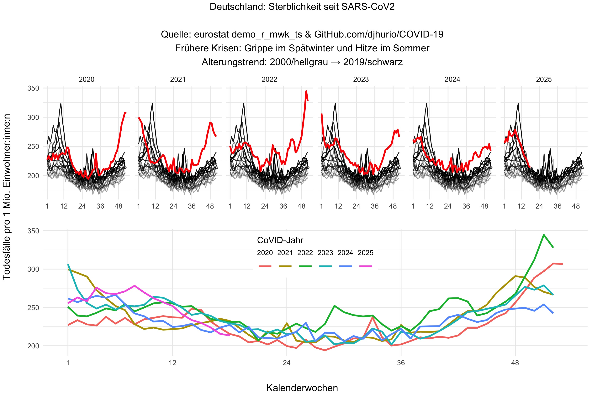

# Wöchentliche Sterblichkeit

[Original-ReadMe von djhurio](https://github.com/djhurio/COVID-19#readme).

Hier: Andere Darstellung fokussiert auf Deutschland,
mit separat zusammengefasster Sterblichkeit der prä-pandemischen Jahre.

[DeStatis](https://www.destatis.de/DE/Themen/Gesellschaft-Umwelt/Bevoelkerung/Sterbefaelle-Lebenserwartung/sterbefallzahlen.html)
dagegen vergleicht die Pandemiejahre mit einem gleitenden 3-Jahresdurchschnitt
(der im Laufe der Jahre eben auch mehr Pandemiejahre mit beinhaltet)
anstatt mit mehreren Jahren *vor* CoVID19.
Zwar machen sie diesen "Wechsel des Bezugszeitraums" kenntlich,
aber für eine Erklärung dieses schmalen und vermischten Zeitraumes wäre ich dankbar.
Nein, nicht einfach nur [diese Erklärung](https://twitter.com/TheVertlartnic/status/1672698705617600512)...
Klarer Fall von [shifting baseline](https://en.wikipedia.org/wiki/Shifting_baseline).

[EuroMOMO.eu](https://www.euromomo.eu/bulletins/2023-08/) erlaubt sich
bei der "age group 0-14 years" auch einen Augenbrauen-hebenden Kniff:
Keine Daten von vor 2018 visualisieren.
Dort scheint die Kindersterblichkeit zu sinken.
Würde so eine eventuelle Trendumkehr davon vielleicht weniger deutlich?
